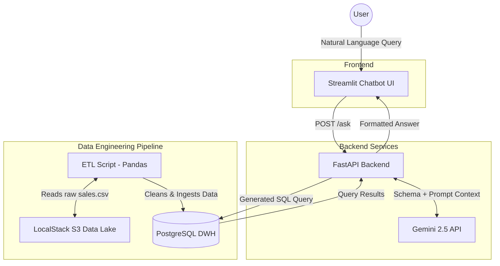

# 🚀 GenAI Retail Data Warehouse Pipeline

## 📌 Overview

This project is a comprehensive, full-stack Data Engineering and Generative AI solution. It simulates a modern cloud-native architecture locally using Docker, featuring a mock AWS S3 Data Lake, an automated ETL pipeline, a PostgreSQL Star Schema Data Warehouse, and a LLM-powered natural language Chatbot interface.

This project was built to demonstrate proficiency in:

- Cloud Storage Simulation (LocalStack)
- Data Engineering & ETL Pipelines (Pandas, Boto3, SQLAlchemy)
- Data Warehousing (Kimball Star Schema)
- Backend API Development (FastAPI)
- Applied Generative AI (Gemini 2.5 Flash, Few-Shot Prompting, Text-to-SQL)
- Frontend Development (Streamlit)
- Container Orchestration (Docker Compose)

---

## 🏗️ System Architecture & Data Flow

### Architecture Diagram

_(A Mermaid diagram illustrating the container network and data paths)_



### 🔄 Request Lifecycle (Data Flow)

1. **User Input:** The user types a question in English or Arabic via the Streamlit UI.
2. **API Interception:** The FastAPI backend receives the query at the `/ask` endpoint.
3. **Prompt Engineering:** The backend injects the user's question into a highly structured prompt containing the Star Schema metadata and specific business rules.
4. **LLM Translation:** The Gemini API processes the prompt and returns a clean PostgreSQL `SELECT` query (handling bilingual semantic translation autonomously).
5. **Security Validation:** The API passes the generated SQL through a regex-based security filter to prevent SQL Injection (blocking `DROP`, `DELETE`, etc.) and ensures it uses a `SELECT` or `WITH` clause.
6. **Execution & Return:** The validated SQL runs against the PostgreSQL Data Warehouse, and the results, along with the generated SQL code, are sent back to the UI for display.

---

## ⚙️ Setup & Installation Instructions

### 1. Prerequisites

- Docker and Docker Compose installed.
- A valid Gemini API Key.

### 2. Environment Configuration

Create a `.env` file in the root directory and add your API key:

```env
GEMINI_API_KEY=your_actual_api_key_here
```

### 3. Build & Run the Stack

Run the following command to build the images and spin up the containers:

```bash
docker-compose up -d --build
```

_This launches: LocalStack (S3), PostgreSQL, FastAPI, and Streamlit._

### 4. Provision Infrastructure & Run ETL

Once the containers are healthy, execute the pipelines in the following order:

**Step A: Provision S3 and Upload Raw Data**

```bash
docker exec -it api_backend python infrastructure/init_s3.py
```

**Step B: Run Medallion ETL (Bronze -> Silver -> Gold)**

```bash
docker exec -it api_backend python data_pipeline/etl_script.py
```

### 5. Access the Application

- **Frontend UI (Streamlit):** [http://localhost:8501](http://localhost:8501)
- **Backend API Docs (Swagger):** [http://localhost:8000/docs](http://localhost:8000/docs)

---

## 📊 Analytics Insights (Part II Responses)

By interacting with the Data Warehouse via the AI Assistant, we discovered:

- **Average Order Value:** ~$459.48
- **Most Expensive Product Ordered:** Cisco TelePresence System EX90 Videoconferencing Unit.
- **Top Selling Product (by Revenue):** Canon imageCLASS 2200 Advanced Copier.

---

## ⚖️ Architectural Trade-offs & Production Considerations

To complete this assessment within a prototyping timeframe, certain architectural compromises were made. In a true **Production Environment**, I would adapt the system as follows:

1. **ETL Processing (Pandas vs. Spark):** - _Current:_ Pandas was used for ETL because the `sales.csv` dataset is small and fits in memory.
   - _Production:_ For multi-gigabyte/terabyte datasets, I would replace Pandas with **Apache Spark (PySpark)** and orchestrate the pipeline using **Apache Airflow** or **Dagster**.
2. **LLM Reliability (Rate Limits):**
   - _Current:_ Used Gemini 2.5 Flash free tier, which occasionally resulted in `429 Quota Exceeded` errors during rapid testing.
   - _Production:_ I would implement an **LLM Fallback Mechanism** (e.g., routing to OpenAI/Claude if Gemini fails), alongside **Redis Caching** to serve repeated questions instantly without hitting the LLM API.
3. **Data Warehouse (PostgreSQL vs. OLAP):**
   - _Current:_ Used PostgreSQL to simulate the DWH.
   - _Production:_ I would migrate the Star Schema to a true columnar OLAP database like **Snowflake**, **Amazon Redshift**, or **Google BigQuery** for massively parallel analytical processing.
4. **Semantic Ambiguity (Business Rules):**
   - _Observation:_ The LLM maps terms differently based on language context (e.g., "least ordered" -> `COUNT()`, "least selling" -> `SUM()`).
   - _Production:_ Implement a semantic layer (like `dbt`) or inject strict corporate terminology definitions into the LLM system prompt to ensure Data Governance and metric consistency.
